<div align="center">

# European Payments Transformation
### *for the instant era* · *pour l'ère de l'instantané*

**How should a European bank transform its payments operating model for the instant payments era?**<br>
**Comment une banque européenne doit-elle transformer son modèle opérationnel des paiements pour l'ère des paiements instantanés ?**

[](https://YOUR-USERNAME.github.io/european-payments-transformation/)


[**English**](#-english) · [**Français**](#-français)

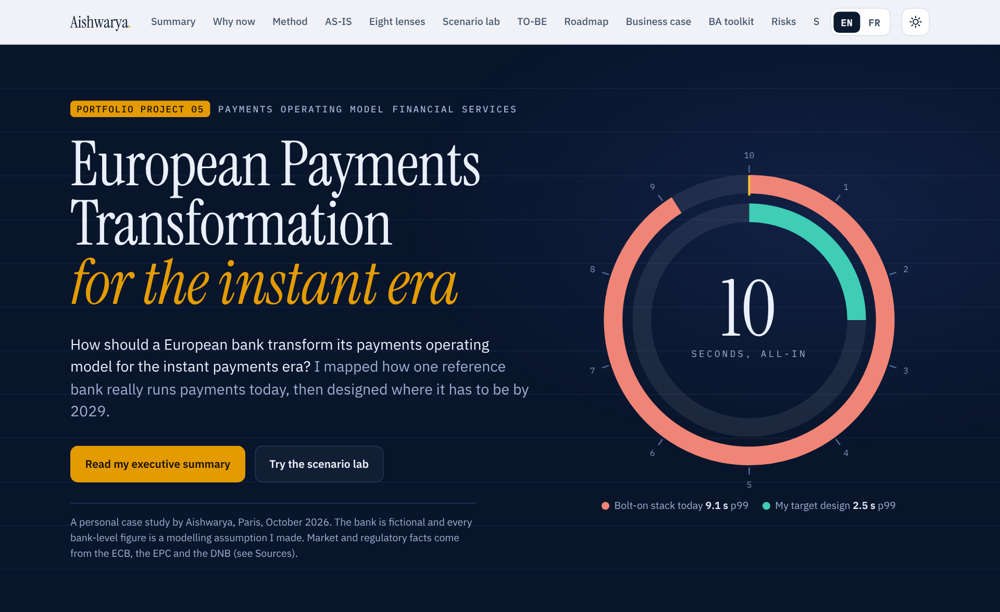

</div>

---

# 🇬🇧 English

## What this is

A consulting-style case study I built on my own, to show how I connect **systems, processes and strategy** on a topic that sits at the heart of European banking: **instant payments**.

I took one fictional euro-area bank that met the 2025 instant payments deadlines the way most banks did, by wrapping a batch-era stack in an instant gateway. Then I asked what it takes to turn "compliant" into "transformed", and I designed the path from **AS-IS to TO-BE** with a four-phase roadmap:

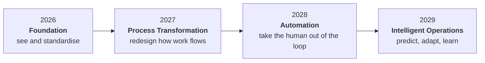

> **Important.** This is a personal portfolio project, not a client engagement. The reference bank is fictional. Every bank-level number (latencies, KPIs, costs, benefits, volumes) is an assumption I set to make the reasoning concrete. Market and regulatory facts come from public sources listed [below](#sources).

## The thesis

> *Compliance got banks to the starting line. The operating model decides who stays in the race.*

| What I found | Why it matters |
|---|---|
| **Compliant, not transformed.** Average maturity of **2.0 / 5** across eight lenses. | Compliance is the strongest lens (3.0). Architecture and exception handling are the weakest (1.5). |
| **The 10 seconds are 91% spent.** The bolt-on stack uses **9.1 s** at p99. | A slow beneficiary bank or a busy fraud engine is enough to miss the target. My redesigned flow needs **2.5 s**. |
| **The problems sit in the seams.** | Fraud, sanctions, liquidity and exceptions run as silos. A Saturday-night incident becomes a Monday-morning problem. |

## The eight lenses

| Lens | The question I asked |
|---|---|
| **Payment flows** | Where does a payment spend its ten seconds? |
| **Operational processes** | Who touches it, when, and why? |
| **Fraud controls** | Can I stop a bad payment in 300 ms without blocking a good one? |
| **Customer experience** | How long until the customer is certain? |
| **Settlement and liquidity** | Is there liquidity at 03:00 on a Sunday? |
| **Exception management** | What happens when the happy path breaks? |
| **Compliance** | Which obligations are met by design, and which by effort? |
| **Technology architecture** | Does the platform bend or break at ten times the volume? |

## What's inside

<table>
<tr>
<td width="50%">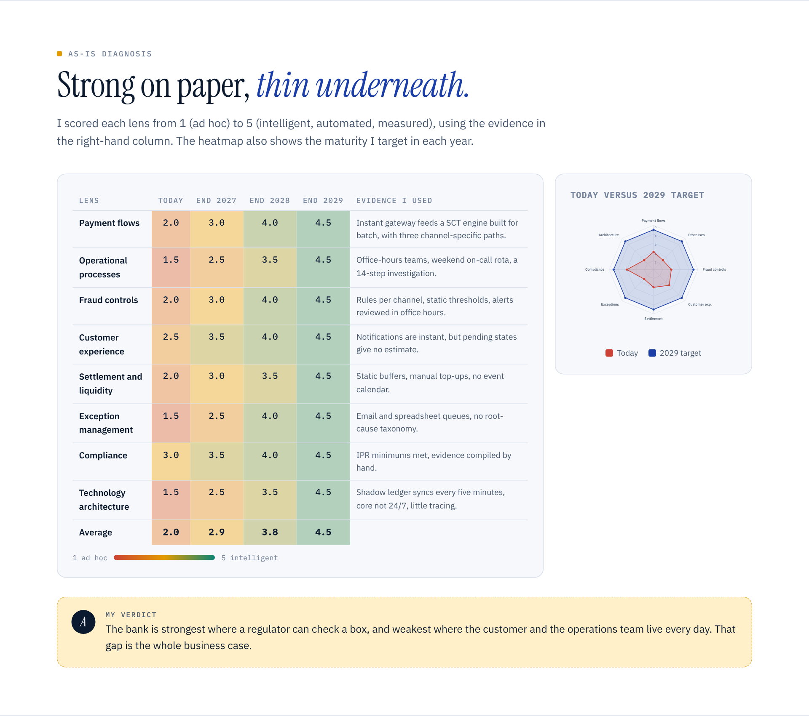<br><sub><b>AS-IS diagnosis.</b> Maturity heatmap with evidence, plus today versus the 2029 target on a radar.</sub></td>
<td width="50%">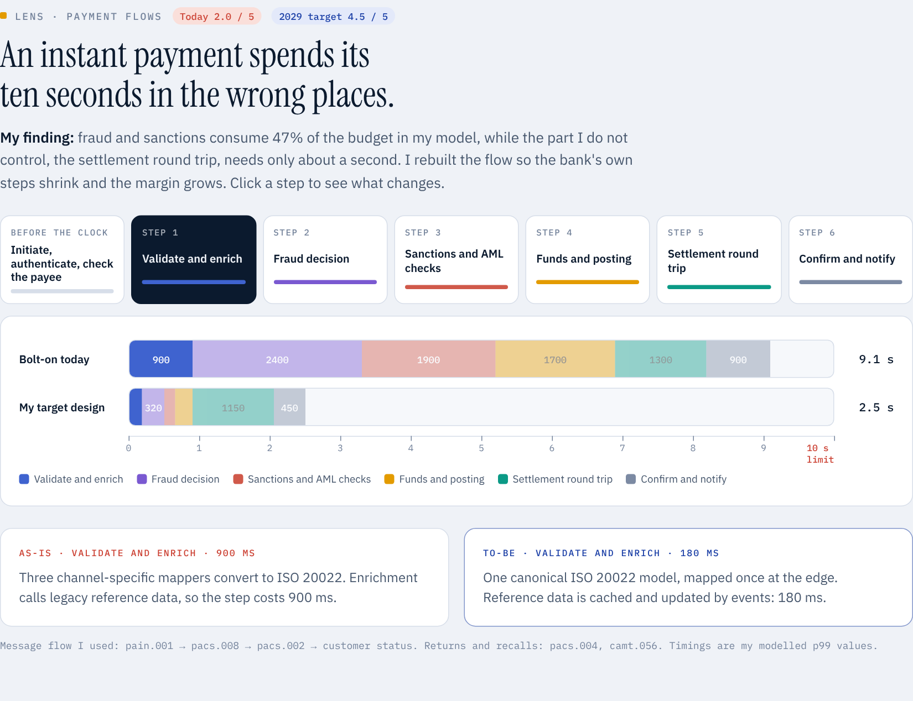<br><sub><b>Payment flows.</b> A clickable 7-step flow and a to-scale latency budget, bolt-on against my target design.</sub></td>
</tr>
<tr>
<td>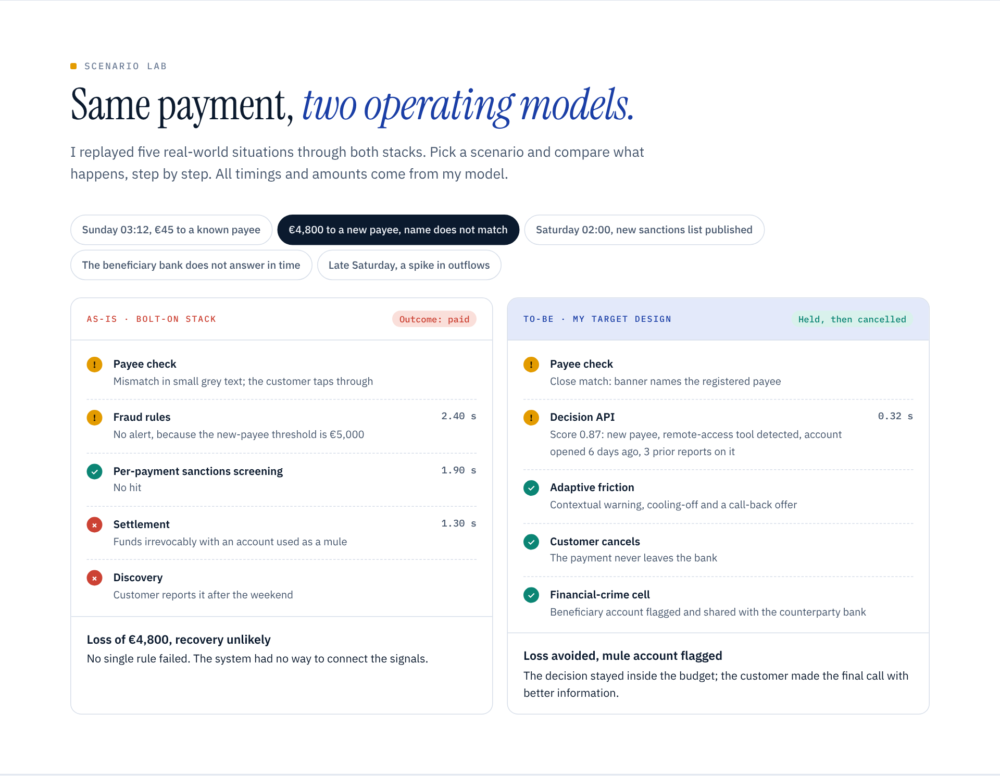<br><sub><b>Scenario lab.</b> Five real-world situations replayed through both operating models: a scam payment, a sanctions update, a counterparty timeout, a liquidity spike.</sub></td>
<td>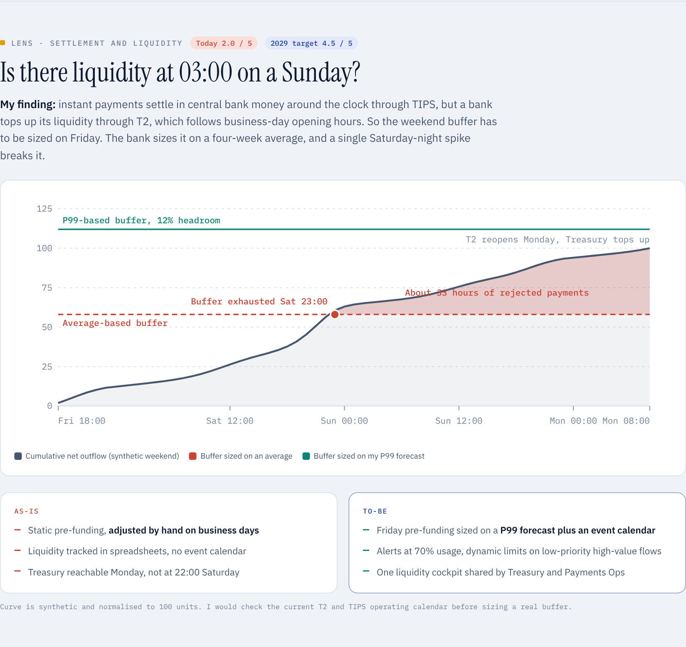<br><sub><b>Settlement and liquidity.</b> Why a weekend buffer sized on an average breaks, and how a P99 forecast holds.</sub></td>
</tr>
<tr>
<td>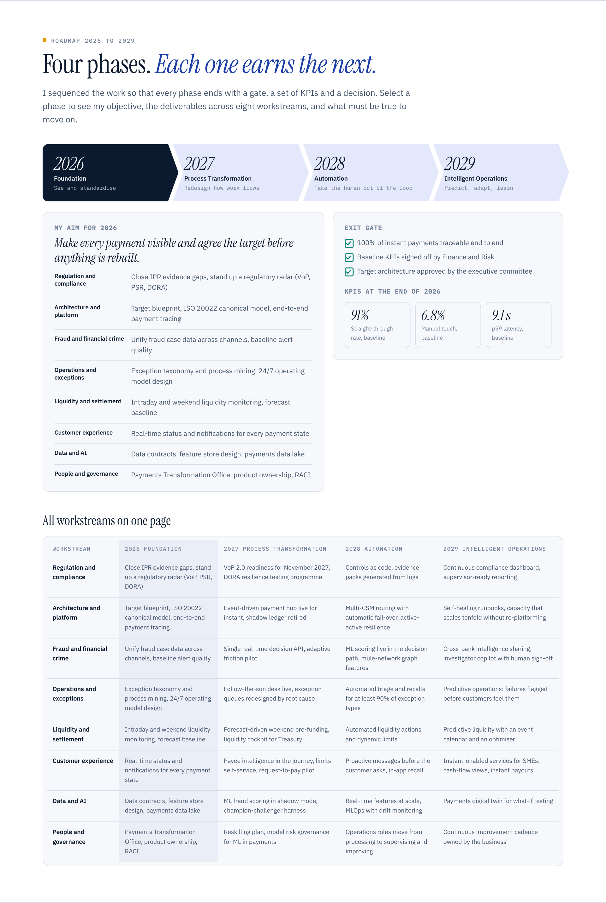<br><sub><b>Roadmap 2026 to 2029.</b> Four phases, eight workstreams, an exit gate and KPIs for each phase.</sub></td>
<td>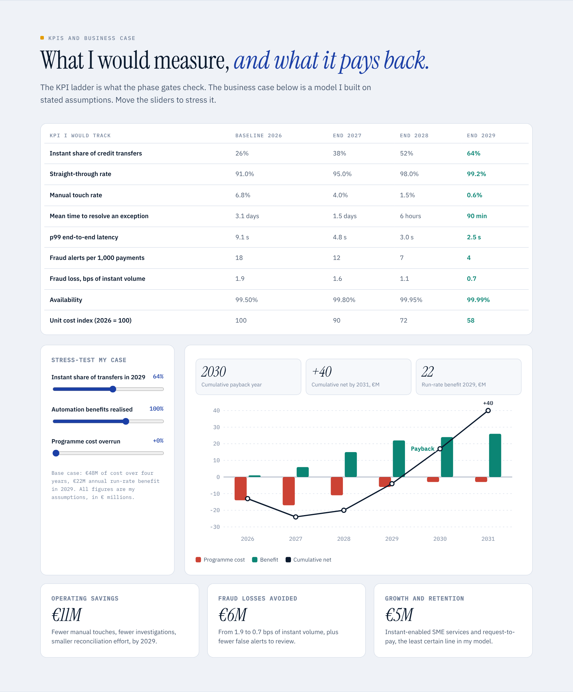<br><sub><b>Business case sandbox.</b> Move three sliders (instant share, automation realised, cost overrun) and watch the payback year move.</sub></td>
</tr>
</table>

Also in the page: the regulatory timeline, a TO-BE operating model, and a **business analysis toolkit** (stakeholder map, eight business requirements, four personas, risk register).

## Highlights

- **Bilingual.** One click switches the entire study between English and French, charts and interactive content included.
- **Light and dark themes**, responsive down to phone width.
- **Interactive on purpose.** Click a step, pick a scenario, select a phase, stress-test the business case.
- **Zero dependencies.** One HTML file, vanilla JavaScript, inline SVG charts. Fonts are loaded from Google Fonts.

## Key figures

| | AS-IS (2026) | TO-BE (2029 target) |
|---|---|---|
| Instant share of credit transfers | 26% | 64% |
| Straight-through rate | 91.0% | 99.2% |
| Manual touch rate | 6.8% | 0.6% |
| p99 end-to-end latency | 9.1 s | 2.5 s |
| Fraud loss, bps of instant volume | 1.9 | 0.7 |
| Unit cost index (2026 = 100) | 100 | 58 |

*Modelled targets. Base case: about €48M of programme cost over four years, about €22M of annual run-rate benefit in 2029, cumulative payback in 2030.*

## Run it

No build step.

```bash
git clone https://github.com/YOUR-USERNAME/european-payments-transformation.git
cd european-payments-transformation
open index.html            # or: python3 -m http.server 8000
```

To publish it yourself: **Settings → Pages → Deploy from a branch → `main` / root**.

## Repository layout

```
.
├── index.html     # the whole case study (HTML, CSS, JS, translations)
├── assets/        # screenshots used in this README
├── README.md
└── LICENSE
```

## How I'd take it further

- Replace my exception taxonomy with shares mined from real exception logs.
- Calibrate the latency budget on production traces.
- Rebuild the liquidity curve from actual weekend flows and the live T2 and TIPS calendar.

## Sources

- EPC update on payment schemes and VoP deployment, ECB AMI-Pay, 5 May 2026: [PDF](https://www.ecb.europa.eu/paym/groups/shared/docs/07bd9-ami-pay-2026-05-05-4.-epc-update-on-payment-schemes-and-vop-deployment.pdf). Instant share of SEPA credit transfers (35.6% in Q1 2026), 2025 volumes (10.1bn, +73%), PSP adoption (93% of euro-area PSPs), VoP v1.1 and v2.0 dates.
- DNB, [Instant Payments Regulation: new obligations](https://dnb.nl/en/sector-news/supervision-2025/instant-payments-regulation-new-obligations). Receive, send, Verification of Payee, screening and 10-second requirements, with deadlines.
- ECB, [Instant payments](https://www.ecb.europa.eu/paym/retail/instant_payments). TIPS, SCT Inst availability 24/7/365, T2.

Dates for non-euro Member States and for DORA come from my own reading and should be re-checked before anyone relies on them.

## About me

I'm **Aishwarya**, based in Paris, working across business analysis, process design and transformation in financial services. This project is part of a portfolio of personal case studies built to show how I think about systems, processes and strategy.

## License

[MIT](LICENSE). Feel free to learn from it. If you reuse the structure, a mention is appreciated.

---

# 🇫🇷 Français

## De quoi s'agit-il

Une étude de cas façon cabinet de conseil, construite par mes soins, pour montrer comment je relie **systèmes, processus et stratégie** sur un sujet au cœur de la banque européenne : les **paiements instantanés**.

Je suis partie d'une banque fictive de la zone euro qui a tenu les échéances 2025 comme la plupart des banques, en enveloppant un empilement de l'ère batch dans une passerelle instantanée. Je me suis demandé ce qu'il faut pour passer de « conforme » à « transformée », et j'ai dessiné le chemin de l'**AS-IS au TO-BE** avec une roadmap en quatre phases :

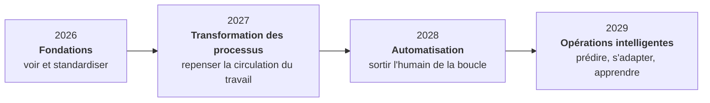

> **Important.** Il s'agit d'un projet de portfolio personnel, pas d'une mission client. La banque de référence est fictive. Chaque chiffre au niveau de la banque (latences, KPI, coûts, bénéfices, volumes) est une hypothèse que j'ai posée pour rendre le raisonnement concret. Les faits de marché et de réglementation viennent de sources publiques, listées [ci-dessous](#sources-1).

## La thèse

> *La conformité a mené les banques sur la ligne de départ. Le modèle opérationnel décide qui reste dans la course.*

| Ce que j'ai constaté | Pourquoi c'est important |
|---|---|
| **Conforme, pas transformée.** Maturité moyenne de **2,0 / 5** sur huit axes. | La conformité est l'axe le plus fort (3,0). L'architecture et la gestion des exceptions sont les plus faibles (1,5). |
| **Les 10 secondes sont consommées à 91 %.** L'empilement bolt-on utilise **9,1 s** en p99. | Une banque bénéficiaire lente ou un moteur antifraude chargé suffit à rater la cible. Mon flux redessiné en demande **2,5 s**. |
| **Les problèmes se logent dans les jonctions.** | Fraude, sanctions, liquidité et exceptions fonctionnent en silos. Un incident du samedi soir devient un problème du lundi matin. |

## Les huit axes

| Axe | La question que je me suis posée |
|---|---|
| **Flux de paiement** | Où un paiement dépense-t-il ses dix secondes ? |
| **Processus opérationnels** | Qui y touche, quand et pourquoi ? |
| **Contrôles antifraude** | Puis-je arrêter un mauvais paiement en 300 ms sans en bloquer un bon ? |
| **Expérience client** | Combien de temps avant que le client soit certain ? |
| **Règlement et liquidité** | Y a-t-il de la liquidité à 03:00 un dimanche ? |
| **Gestion des exceptions** | Que se passe-t-il quand le chemin nominal casse ? |
| **Conformité** | Quelles obligations sont respectées par conception, lesquelles par effort ? |
| **Architecture technique** | La plateforme plie-t-elle ou casse-t-elle à dix fois le volume ? |

## Contenu

<table>
<tr>
<td width="50%">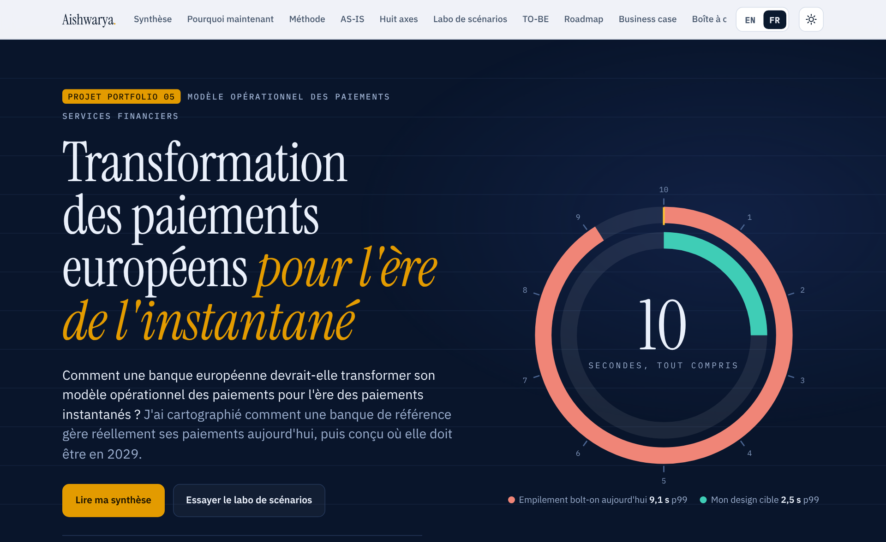<br><sub><b>Version française.</b> Un clic sur <code>EN | FR</code> traduit toute l'étude, graphiques et contenus interactifs compris.</sub></td>
<td width="50%">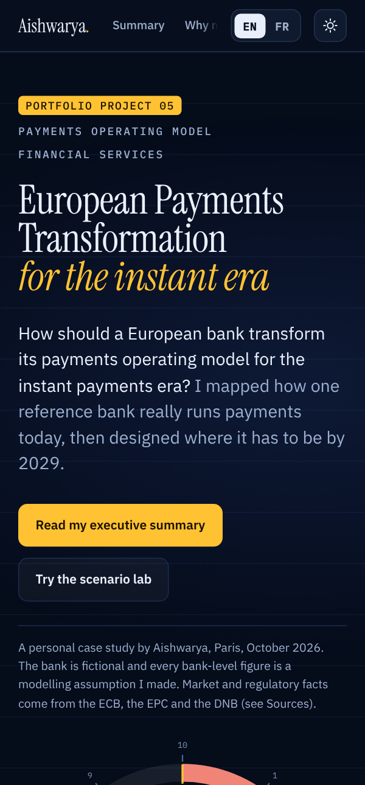<br><sub><b>Mobile et thème sombre.</b> La page s'adapte jusqu'à la largeur d'un téléphone.</sub></td>
</tr>
</table>

- **Diagnostic AS-IS** : heatmap de maturité avec les preuves, et radar aujourd'hui contre cible 2029.
- **Flux de paiement** : parcours cliquable en 7 étapes et budget de latence à l'échelle.
- **Laboratoire de scénarios** : cinq situations réelles rejouées dans les deux modèles (paiement frauduleux, mise à jour de sanctions, timeout d'une banque correspondante, pic de liquidité).
- **Règlement et liquidité** : pourquoi un coussin de week-end calé sur une moyenne casse, et comment une prévision P99 tient.
- **Roadmap 2026 → 2029** : quatre phases, huit chantiers, un critère de sortie et des KPI par phase.
- **Simulateur de business case** : trois curseurs (part d'instantané, automatisation réalisée, dépassement de coût) et l'année de retour sur investissement qui bouge.
- **Boîte à outils d'analyse métier** : cartographie des parties prenantes, huit exigences métier, quatre personas, registre des risques.

## Points forts

- **Bilingue.** Un clic bascule toute l'étude entre l'anglais et le français.
- **Thèmes clair et sombre**, adaptés jusqu'à la largeur d'un téléphone.
- **Interactif par choix.** Cliquer une étape, choisir un scénario, sélectionner une phase, mettre le business case à l'épreuve.
- **Zéro dépendance.** Un seul fichier HTML, JavaScript natif, graphiques en SVG intégré. Les polices viennent de Google Fonts.

## Chiffres clés

| | AS-IS (2026) | TO-BE (cible 2029) |
|---|---|---|
| Part d'instantané dans les virements | 26 % | 64 % |
| Taux de traitement automatique | 91,0 % | 99,2 % |
| Taux d'intervention manuelle | 6,8 % | 0,6 % |
| Latence de bout en bout p99 | 9,1 s | 2,5 s |
| Perte fraude, pb du volume instantané | 1,9 | 0,7 |
| Indice de coût unitaire (2026 = 100) | 100 | 58 |

*Cibles modélisées. Scénario de base : environ 48 M€ de coût de programme sur quatre ans, environ 22 M€ de bénéfice annuel en régime de croisière en 2029, retour sur investissement cumulé en 2030.*

## Lancer le projet

Aucune étape de build.

```bash
git clone https://github.com/YOUR-USERNAME/european-payments-transformation.git
cd european-payments-transformation
open index.html            # ou : python3 -m http.server 8000
```

Pour le publier : **Settings → Pages → Deploy from a branch → `main` / racine**.

## Pour aller plus loin

- Remplacer ma taxonomie des exceptions par des parts issues de vrais logs.
- Calibrer le budget de latence sur des traces de production.
- Reconstruire la courbe de liquidité à partir de vrais flux de week-end et du calendrier T2 et TIPS en vigueur.

## Sources

Voir la section [Sources](#sources) ci-dessus (BCE / EPC, DNB, BCE). Les dates pour les États membres hors zone euro et pour DORA viennent de ma propre lecture et doivent être revérifiées avant que quiconque s'y fie.

## À propos

Je suis **Aishwarya**, basée à Paris, et je travaille sur l'analyse métier, la conception de processus et la transformation dans les services financiers. Ce projet fait partie d'un portfolio d'études de cas personnelles qui montrent ma façon de penser systèmes, processus et stratégie.

## Licence

[MIT](LICENSE). Vous pouvez vous en inspirer librement. Si vous reprenez la structure, une mention est appréciée.
